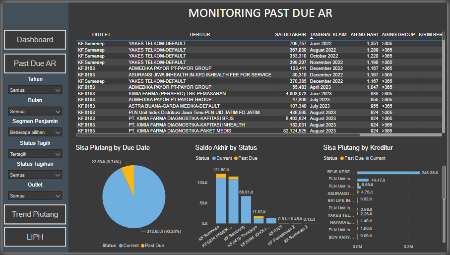
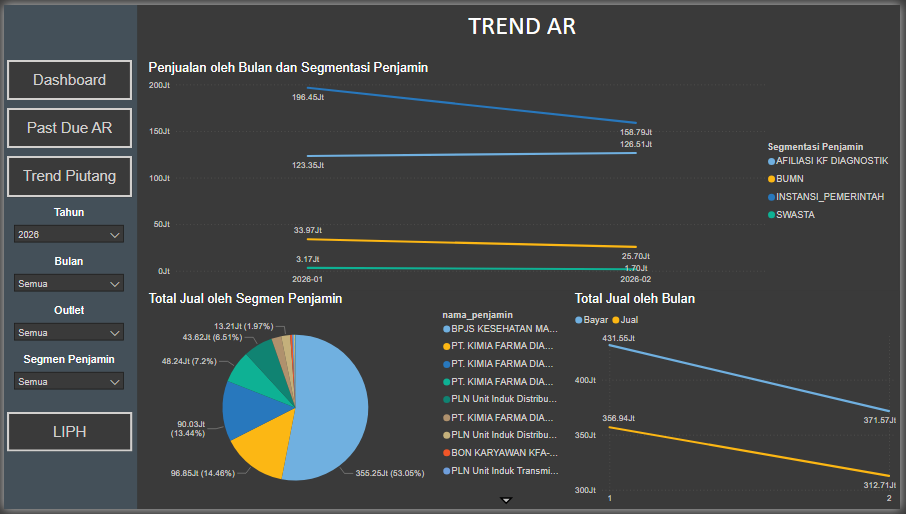
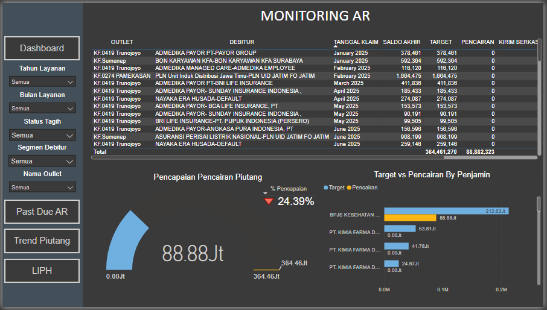

# 📊 Accounts Receivable Analytics Dashboard

## Project Overview

This project presents a **Power BI dashboard** designed to monitor Accounts Receivable performance, analyze customer payment behavior, and identify overdue balances.

The dashboard helps finance teams improve cash flow visibility, track outstanding receivables, and prioritize customer follow-ups based on payment patterns.

This project simulates a real-world **financial analytics scenario** used by finance and accounting teams to manage receivables efficiently.

---

## 🎯 Business Problem

Finance teams often struggle with monitoring overdue receivables and identifying customers who delay payments.

Key challenges include:

* Lack of visibility on overdue invoices
* Difficulty prioritizing collection efforts
* Limited insight into customer payment behavior
* Manual monitoring of receivable aging

This dashboard solves those issues by providing **real-time insights into receivable performance.**

---

## 📈 Dashboard Preview

### Accounts Receivable Aging Analysis



---

### Customer Payment Behavior



---

### Outstanding Receivable Trend



---

## 📊 Key Metrics

The dashboard monitors several important Accounts Receivable metrics:

* Total Outstanding Receivable
* Aging Category Distribution
* Average Collection Period
* Customer Payment Trends
* Overdue Receivable Percentage
* Top Customers with Outstanding Balances

---

## 🛠 Tools & Technologies

This project uses the following tools:

* Power BI
* Excel
* Data Modeling
* Financial Analytics
* Data Visualization

---

## 🧠 Key Insights

Some key insights generated from the analysis include:

* A significant portion of receivables falls into the **60+ days overdue category**, indicating potential collection risk.
* A small group of customers contributes disproportionately to outstanding balances.
* Payment trends show seasonal fluctuations that may affect cash flow forecasting.

These insights help finance teams **prioritize collection strategies and improve cash flow management.**

---

## 🧱 Data Workflow

The workflow used in this project:

```
Data Source (Transaction Data)
        ↓
Data Cleaning
        ↓
Data Modeling
        ↓
Power BI Dashboard Development
        ↓
Business Insights & Monitoring
```

---

## 📂 Repository Structure

```
accounts-receivable-analytics-dashboard
│
├── dashboard
│   └── ar_dashboard.pbix
│
├── data
│   └── sample_dataset.csv
│
├── images
│   ├── ar_aging_dashboard.png
│   ├── payment_behavior.png
│   └── outstanding_trend.png
│
└── README.md
```

---

## ▶ How to Use

1. Download the **Power BI (.pbix) file** from the dashboard folder
2. Open using Power BI Desktop
3. Explore the dashboard interactively

---

## 🔗 Live Dashboard (Optional)

If the dashboard is published to Power BI Service, access it here:

[View Dashboard](https://app.powerbi.com/view?r=eyJrIjoiMDc2YjVlMmItYTk0Ny00ZjM3LWIyYzMtMTA3NmYyNWNmMzJhIiwidCI6ImQxN2JhNjg4LWIzYTktNGQ2ZS05NTBmLTQ4OWQ4OGJhOTgyNyIsImMiOjZ9)

---

## 👨‍💻 Author

**Zenobius Oktavianus**

Data Analyst | Financial Analytics | Power BI

LinkedIn: (add your LinkedIn profile here)
GitHub: (add your GitHub profile here)

---

## 📌 Project Purpose

This project is part of my **Data Analytics Portfolio**, demonstrating how financial data can be transformed into actionable insights using Power BI.

The goal is to showcase practical skills in:

* Data analysis
* Dashboard development
* Financial data interpretation
* Business insight generation
